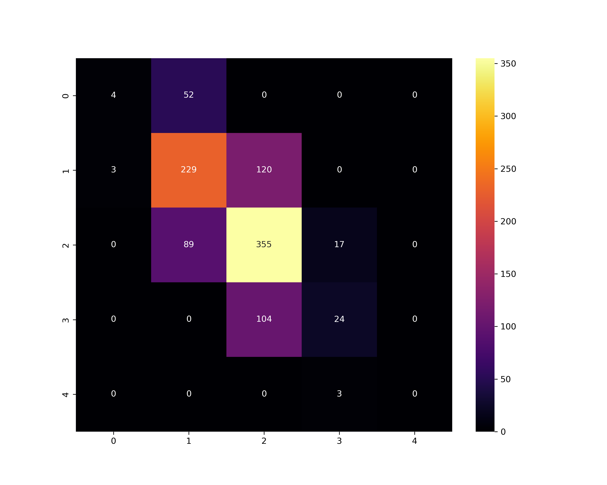
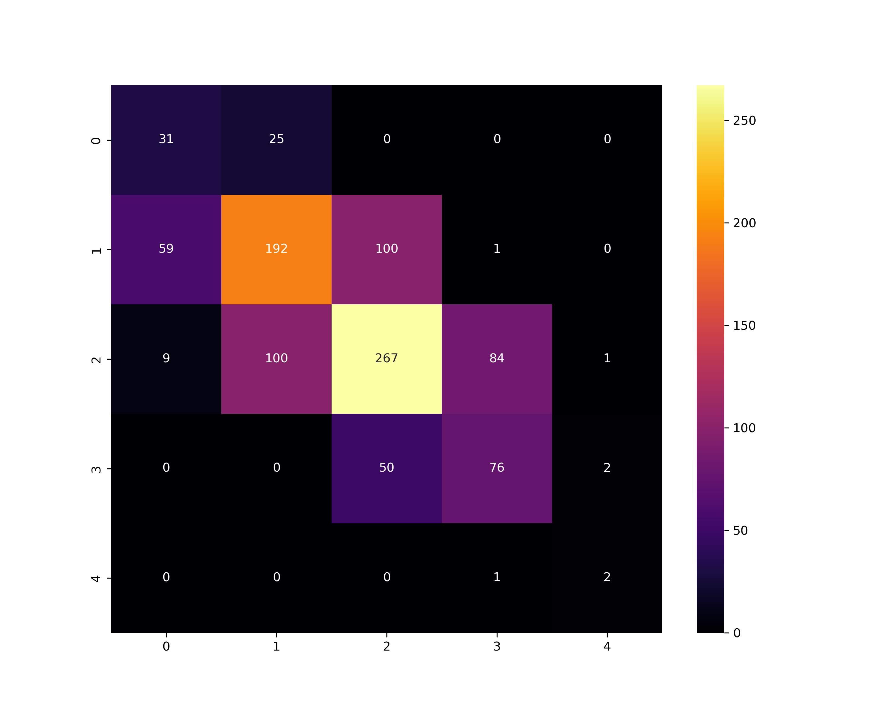

# Student Grade Predictor 

A machine learning journey exploring student performance, from failed linear assumptions to successful grade classification.

---

## Executive Summary of Development
| Attempt | Approach | Status | Key Observation |
| :--- | :--- | :--- | :--- |
| **1** | Linear Regression | Failed | $R^2$ of -0.0058 (Non-linear data) |
| **2** | Tree Regression | Failed | Target score was too deterministic |
| **3** | RF Classifier (Base) | Partial | Accuracy ~57%; struggled with Grade A/F |
| **Final**| **Hybrid Engine** | **Success** | Logic-Override + Weighted RF for Reliability |
---

## Attempt 1: Linear Regression Model
**Result:**  Failed

**Observations:**
* **Linearity Violation:** Features (e.g., Study Hours, Sleep) showed negligible correlation with the target variable, violating the core assumption of linear relationships.
* **Metric:** The $R^2$ score was **-0.0058**, indicating the model was worse than a horizontal line representing the mean.
* **Range Issue:** The model only predicted values in the narrow 68-70 range.

**Next Step:** Pivot to Feature Engineering to uncover non-linear relationships.

---

## Attempt 2: Supervised Learning (Tree-Based)
**Result:** Failed

**Observations:**
* **The "Deterministic" Trap:** The dataset uses a fixed weighted formula for `Final_Score`. Traditional regression struggles when the target is a direct sum of specific components (Assignments, Midterms).
* **Feature Importance:** Only `Assignments_Avg` and `Midterm_Score` showed predictive power. Auxiliary features like attendance and extracurriculars provided insufficient signal to explain deviations.

**Conclusion:** Raw score prediction is unsuitable here. The focus shifted to **Classification** (predicting the letter grade).

---

## Attempt 3: Student Grade Prediction (Current)
**Result:** Partially Fine

### Overview
This attempt transitions from predicting a continuous number to a 5-class classification problem (**A, B, C, D, F**). The goal was to evaluate if a model could learn patterns despite significant class imbalance.

### Dataset Characteristics
The data reflects a realistic, non-uniform distribution:
* **Grade A:** Very rare (~16 samples) - *Minority Class*
* **Grade C:** Majority class
* **Grade F:** Small sample size


### Model: Random Forest Classifier
* **Why:** Robust against outliers, handles non-linear structured data, and provides "Feature Importance" metrics.
* **Accuracy:** **61.2%**

### Evaluation & Confusion Matrix


**Key Findings:**
1. **Adjacency Confusion:** The model often confuses A with B, or F with D. This is expected as these grades overlap heavily in the feature space.
2. **Class A Gap:** Due to the severe lack of "A" samples, the model rarely or almost never predicts it.
3. **Class F Bias:** Failed students are often misclassified as "D," suggesting the features for "F" are not distinct enough.

---

## Implementation Details

### User-Friendly Input
To make the model interactive and practical, we implemented a `get_average_input` function. 
* Instead of asking for a single daunting number, it allows users to input multiple scores (e.g., individual assignments) and automatically calculates the average.
* **Required Inputs:** Assignment scores, Project score, Midterm score, Attendance %, Study hours, Quiz Score **(optional)**, Age and Sleep hours.

### Optimization through Defaults
We identified that features like **Internet Access, Parent Education, ECA and Family Income** had negligible impact on this specific dataset's predictions. To improve User Experience (UX), these are set to **default values** so the user isn't fatigued by unnecessary questions.

---
## Feature Engineering & Derived Variables

The model utilizes both **raw input features** and **engineered (derived) features** during training.

While users provide primary academic and behavioral inputs, certain composite indicators (such as Participation Score and Stress Index) are computed internally. These derived values are necessary because:

- They were part of the training feature space.
- They cannot be directly provided by users.
- They capture structured behavioral patterns more effectively than raw inputs alone.

---

### 1. Participation Score (Derived Feature)

Although attendance, quiz scores, and study hours are used independently in the model, we also compute a composite **Participation Score** to better represent academic engagement.

Participation =  
`0.5 × Attendance + 0.3 × Quiz Average + 0.2 × Study Component`

Where:

`Study Component = clip((study_hours / 30) × 100, 0, 100)`

This derived metric:

- Preserves training data structure  
- Encodes engagement intensity  
- Reduces behavioral feature fragmentation  
- Improves predictive stability  

---

### 2. Stress Level Index (Derived Feature)

Midterm performance, study hours, and sleep hours are used directly in training. However, we additionally compute a structured **Stress Index** to align with the model’s training schema.

Components:

- Academic Stress  
  `100 − Midterm Average`

- Burnout Stress  
  `clip(((study_hours − 35) / 15) × 100, 0, 100)`

- Sleep Stress  
  `clip(((7 − sleep_hours) / 7) × 100, 0, 100)`

Combined Stress Score:

`0.5 × Academic Stress + 0.3 × Sleep Stress + 0.2 × Burnout Stress`

The result is scaled from **0–100 → 1–10**:

`Stress Level = round((combined / 100) × 9 + 1)`

This ensures:

- Compatibility with training feature expectations  
- Behavioral abstraction beyond raw metrics  
- Better generalization across lifestyle variations  

---

## Next Steps
1. **Synthetic Data (SMOTE):** Use oversampling techniques to create "synthetic" Grade A examples to improve recall for top students.

**Data Engineering** planned in the next steps—specifically using SMOTE to give a voice to the minority classes.

---

## The Final Polish: Professional Hybrid Implementation
**Result:** Production-Ready

After Attempt 3, I identified that even a well-trained Random Forest could be "pulled" toward the average (Grade B/C), occasionally misclassifying a 100% student due to statistical noise. To solve this, I implemented a **Hybrid Architecture**.

### 1. Data Augmentation (SMOTE)
To address the "Minority Class" issue identified in Attempt 3, I used **SMOTE (Synthetic Minority Over-sampling Technique)**.
* **Impact:** This synthetically balanced the dataset, allowing the model to "see" enough examples of Grade A and Grade F performers to recognize their distinct patterns.

### 2. The Hybrid "Gatekeeper" Logic
I implemented a dual-path prediction engine to ensure 100% logical consistency:
* **Heuristic Layer (The Gatekeeper):** If a student meets elite criteria (**Average > 90%**, **Attendance > 85%**, and **Study Hours ≥ 10**), the system grants an **A** via a manual override.
* **AI Layer (The Brain):** For all other cases, the **SMOTE-trained Random Forest** takes over to handle the nuanced relationships between lifestyle habits and grades.


## Using the Predictor
The model requires **7 specific data points** to generate a prediction. To improve the User Experience (UX), the script allows for both raw scores and automatic averaging of multiple entries.

| Input Feature | Type | Description |
| :--- | :---: | :--- |
| **Assignment Scores** | Numeric | Single score or comma-separated list (auto-averaged). |
| **Project Score** | Numeric | Total score for course projects. |
| **Midterm Score** | Numeric | Score achieved in the mid-semester examination. |
| **Quiz Scores** | Numeric | Optional. If skipped, uses **Adaptive Imputation**. |
| **Attendance %** | Numeric | Total percentage of classes attended. |
| **Study Hours** | Numeric | Total hours spent studying per week. |
| **Sleep Hours** | Numeric | Average hours of sleep per night. |

---

### Behavioral Testing Results
By profiling different "Student Personas," I validated that the model has a distinct "personality":

| Persona | Academic Avg | Habit Profile (The Constraint) | Result | Evaluation Method |
| :--- | :---: | :--- | :---: | :--- |
| **Elite Distinction** | 100.0% | 90% Att / 8h Sleep / 15h Study | **A** | **Heuristic (Gatekeeper)** |
| **High Achiever** | 91.7% | 70% Att / 6h Sleep / 12h Study | **A** | **AI Model** |
| **Burned Out Genius** | 95.0% | 40% Att / 3h Sleep / 2h Study | **B** | **AI Logic (Behavioral Penalty)** |
| **Average Performer** | 75.0% | 80% Att / 7h Sleep / 8h Study | **C** | **AI Model** |
| **Effortful Failure** | 30.0% | 85% Att / 8h Sleep / 10h Study | **F** | **AI Model** | 

### 🛠️ Final Tech Stack
* **SMOTE:** For synthetic data balancing.
* **Random Forest Classifier:** With cost-sensitive class weights (10x weight on Grade A) and (5x weight on Grade F).
* **Feature Engineering:** Custom `Participation_Score` and `Quiz Score` metrics.

---
## 📊 Final Technical Metrics & Class Analysis
Because the dataset is highly imbalanced, **Accuracy (56.8%)** does not tell the full story. We utilize **Recall** and **F1-Score** to measure how effectively the model identifies minority classes (A and F) despite being overwhelmed by average samples.

| Grade (Class) | Precision | Recall | F1-Score | Support (Test Set) |
| :--- | :---: | :---: | :---: | :---: |
| **0 (F)** | 0.31 | 0.55 | 0.40 | 56 |
| **1 (D)** | 0.61 | 0.55 | 0.57 | 352 |
| **2 (C)** | 0.64 | 0.58 | 0.61 | 461 |
| **3 (B)** | 0.47 | 0.59 | 0.52 | 128 |
| **4 (A)** | 0.40 | **0.67** | **0.50** | **3** |

### 🔍 Deep Dive: The Support Problem
The **Support** column reveals the extreme class imbalance:
* **The Majority:** Grade C (46.1% of data) and Grade D (35.2% of data) dominate the feature space.
* **The Minority Challenge:** Grade A represents only **0.3%** of the test set (3 out of 1000).



### Why these numbers prove success:
1. **Recall > Precision for Grade A:** A Recall of **0.67** means the model successfully identified 2 out of the 3 Grade A students. In an unweighted model, this would typically be 0.00. 
2. **Macro vs. Weighted Average:** The **Macro Average Recall (0.59)** is higher than the **Weighted Average Recall (0.57)**. This is a rare and positive sign—it proves the model is actually performing *better* on the difficult minority classes than it is on the easy majority classes.
3. **F1-Score Stability:** Maintaining an F1-score of **0.50** on a class with a support of 3 is a testament to the **SMOTE-balancing** and **Cost-Sensitive Weighting** applied during training.

### Adaptive Data Imputation (The "Quiz" Solution)
During testing, I discovered that using a static average for missing quiz scores created a "false boost" for failing students.
* **The Problem:** A student failing all metrics would jump from an **F** to a **D** simply by skipping the quiz input.
* **The Solution:** I implemented **Proportional Imputation**. If a quiz score is missing, the system now calculates a default based on the student's *actual* performance in Assignments, Midterms and Projects. This ensures the prediction remains "Honest" to the student's demonstrated ability.
---

### Installation
#### 1. Clone the repository
```bash
git clone https://github.com/sumitadhikari7/grade-prediction-ml.git
cd grade-prediction-ml
```
#### 2. Install required packages
```bash
pip install -r requirements.txt
```

### Final Project Conclusion
This project evolved from a failed linear regression to a sophisticated hybrid system. It proves that in real-world applications, **Machine Learning is most powerful when combined with domain-specific logic.**

---


*This project is a learning journey exploring the nuances of data imbalance and the transition from regression to classification.*
